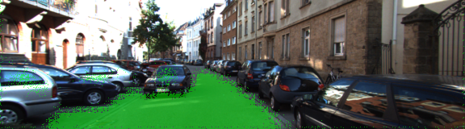

# CarND Segmentation Segmentation - Gaspard Shen

In this project, we need label the pixels of the road in images instead of the bounding box. To achieve that goal, we use the Fully Convolutional Network(FCN) and implementation is based on the FCN-8 architecture developed from Berkely paper "Fully Convolutional Networks for Semantic Segmentation". In the end, I can identify the pixels of the road in the images quite well.

## Implementations

The FCN-8 architecture include the Encoder and Decoder part. The encoder for the FCN-8 is the VGG16 model pretrained on ImageNet for classification. So first we need to load the pretrained vgg model in the functions `load_vgg`. Using the `graph.get_tensor_by_name` function the load specific layer of the vgg16.

Next is the decoder portion of the FCN-8. At this stage we upsample the input and add skip connection to the model. In the functions `layer`, we use `tf.layers.conv2d_transpose` to upsample and `tf.add` to add skip connections.

Third part of implementation is to define the loss function. In functions `optimize`, we use the standard cross entropy loss by using `tf.nn.softmax_cross_entropy_with_logits`.

The final step is the training part in the functions `train_nn`, based on all the hyper parameter and start training.

## Neural Network training
During the training, I found out that after about 48 epochs, the loss was stop to decreasing. Look like over 48 epochs, the model was overfitting, so in the end i choose **48 epochs** and the **batch size is 5**.

## Results
Here list couple great example that we can identify the pixels of the roads. More than that we can avoid the car on the roads which was quite impressive.

Next example was much complicate cases. There are lots of car parking at the side of load and other car was in the opposite lane. This time we can see the different result when the epochs at 12 and the final setting 48. As we can see the at epochs 12 cases, the opposite lane car and some car was marked as the road. But at the epochs 48 cases, we can clearly identify the road in this complicate scene without mark the parking car and opposite car as the roads.

_Epochs 12_

_Epochs 48_

